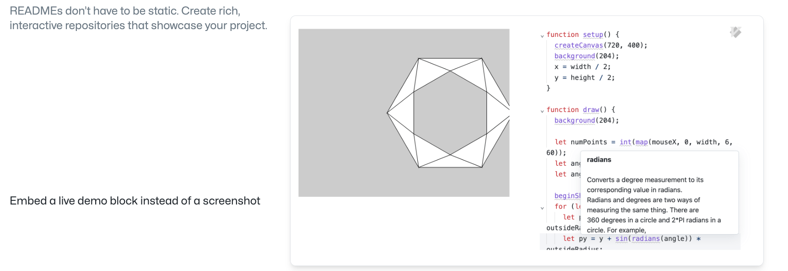
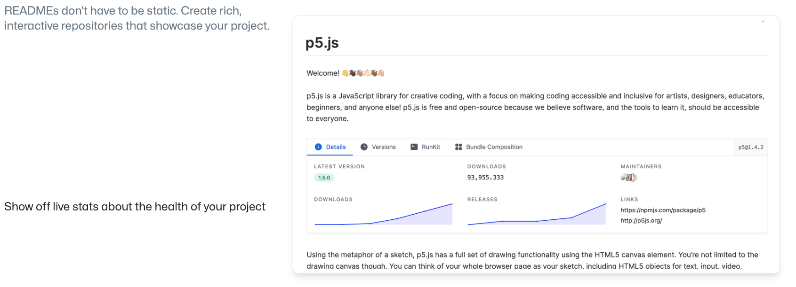
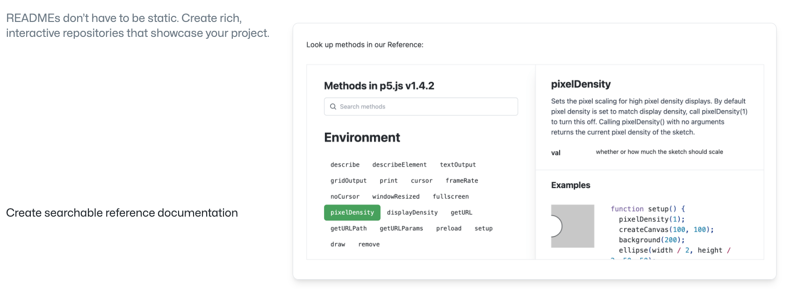
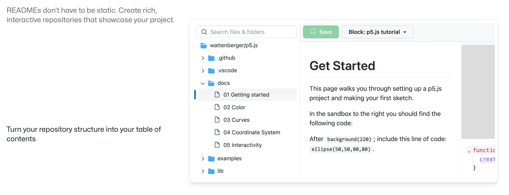
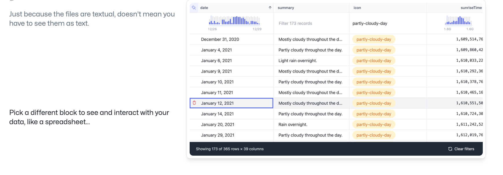
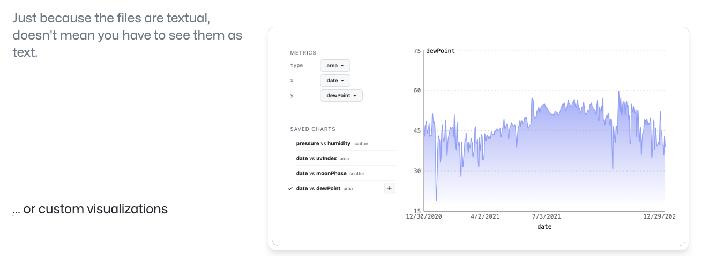
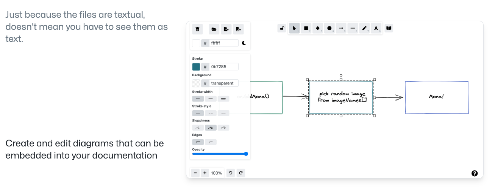
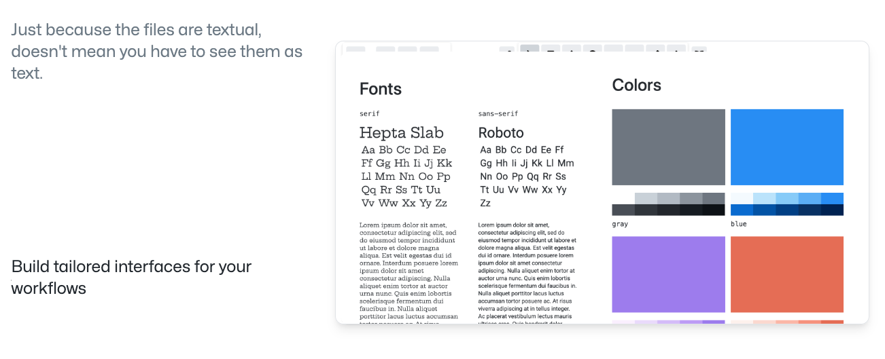
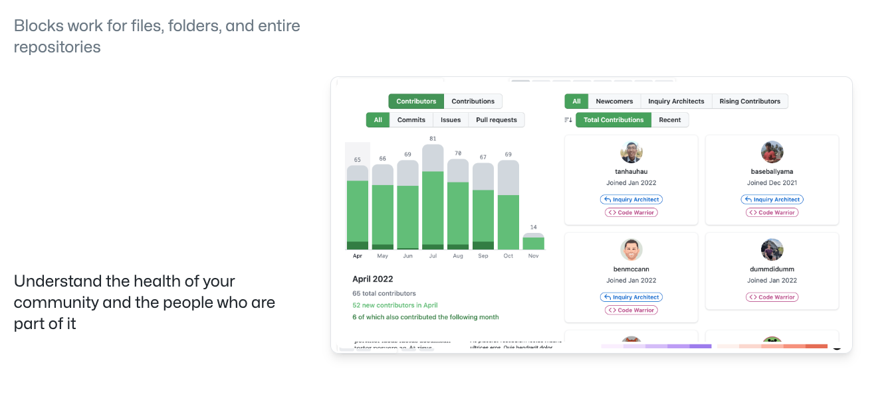
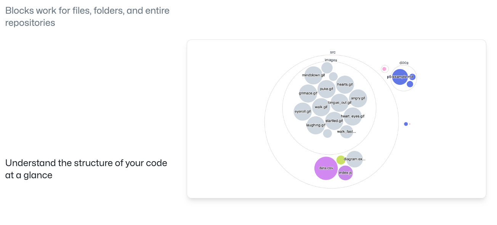

[官方展示链接](https://blocks.githubnext.com/)

## 新特性介绍

- Github 仓库的 README.md 文件没有办法像现在很多静态网站框架直接 embed 一个demo 进来，所以就只能用 截图来展示效果，所以针对这个痛点，github 将会支持直接在 README.md 中直接插入 demo 方便大家更清楚直观的了解对应内容。

- 直接展示有关项目健康状况的实时统计数据

- 文档内容太多只能靠 `command + f` 搜索？新版 github 拥有可搜索的参考文档了!

- 根据项目的文件结构生成目录，`Octotree` 可以退役啦

- 有些文件的原始形式都易于理解，例如 CSV 或 JSON 数据，所以新版本不仅可以用易读的形式来查看数据，并且重点是可以**与之交互**! 

当然你也可以选择以图表的形式来查看这些内容:

- 当然也有了可以插入到文档中的可编辑图表

- 还可以为你的工作流量身定制用户界面

- 可以更好的看到社区成员的状态

- 一目了然地了解你的代码结构

