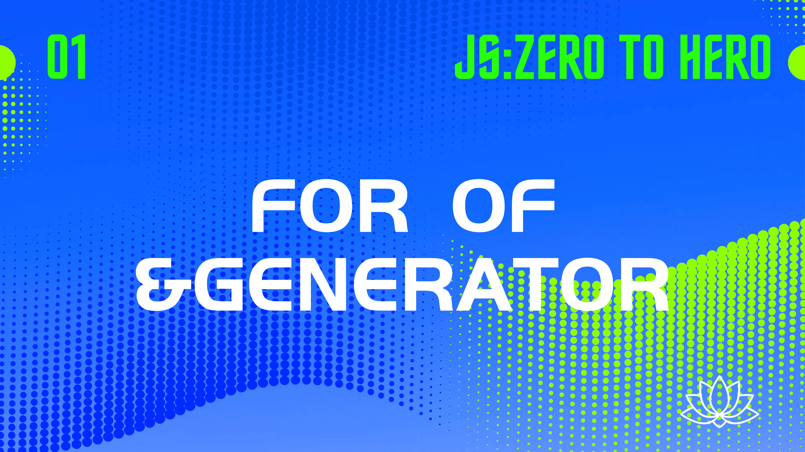
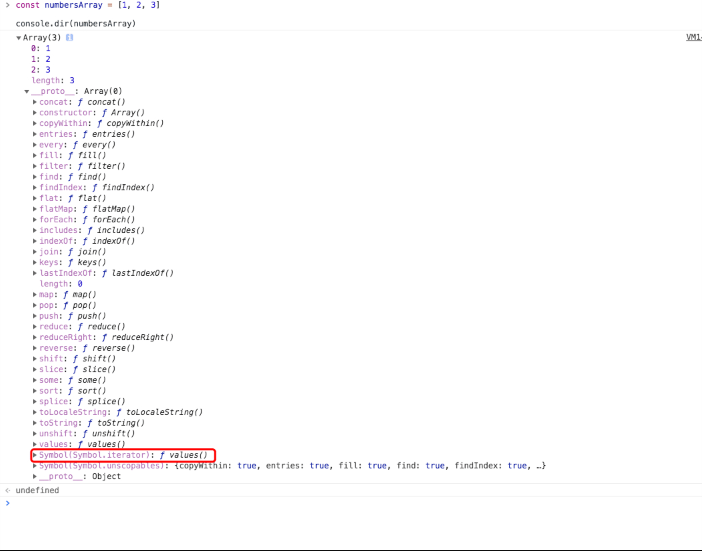
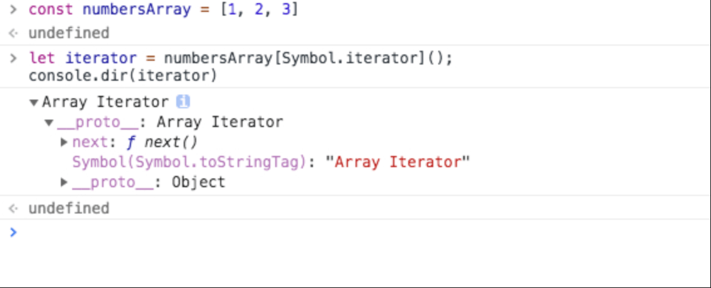
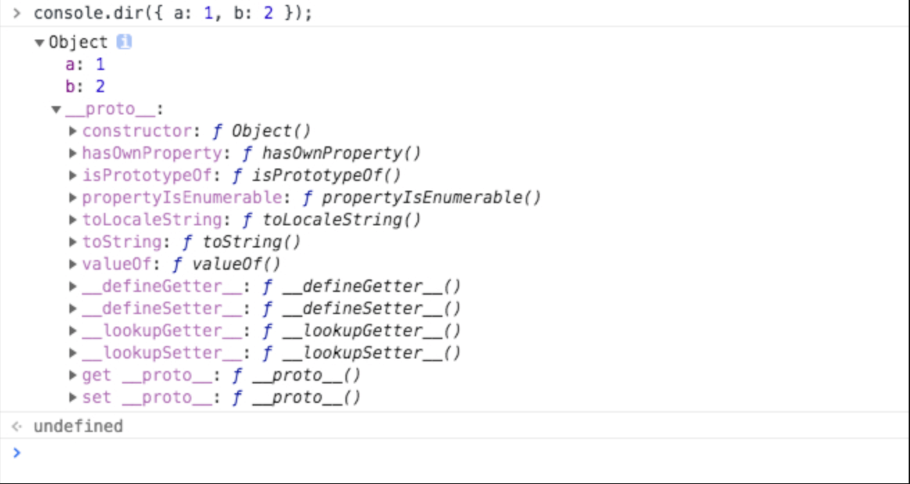
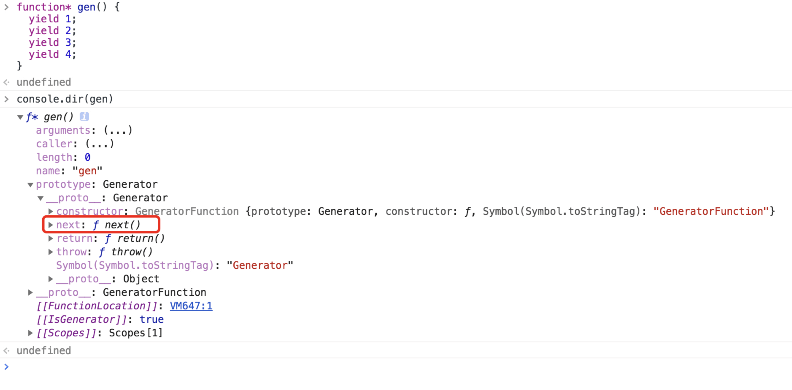
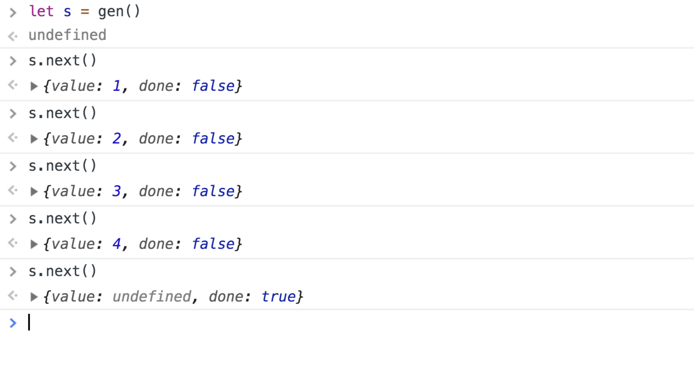
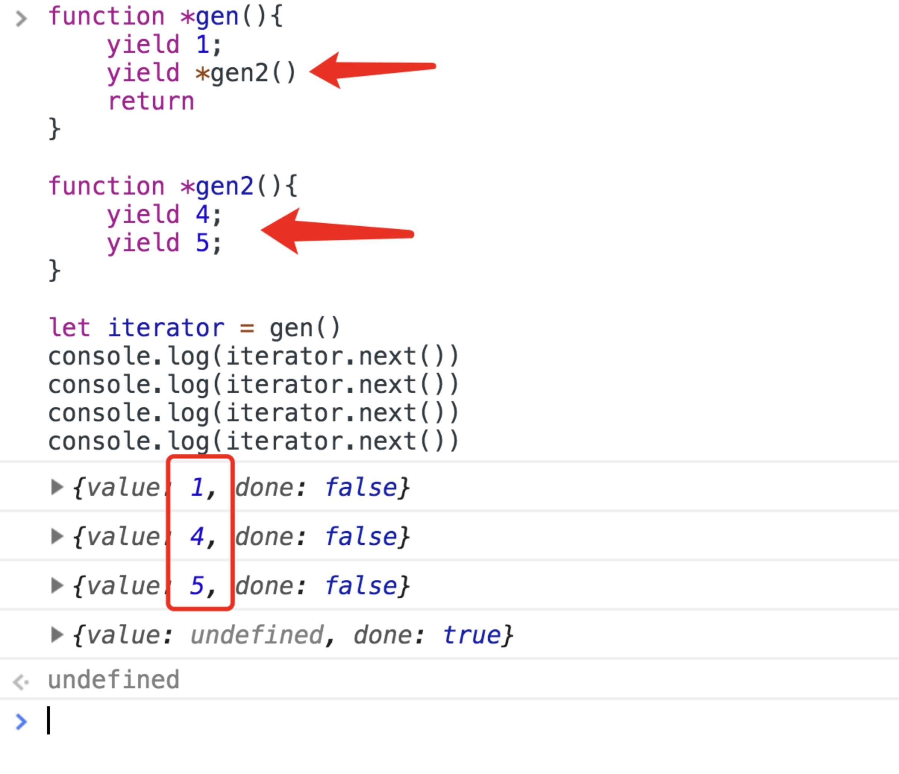

## 聊聊 `for of`

说起 `for of` 相信每个写过 `JavaScript` 的人都用过 `for of` ，平时我们用它做什么呢？大多数情况应该就是遍历数组了，当然，更多时候，我们也会用 `map()` 或者 `filer()` 来遍历一个数组。 但是就像我们标题里面说的，它跟 `Generator` 能扯上什么关系呢？

首先我们想一个问题，为什么使用 `for of` 或者 `map()`/`filer()` 方法就可以遍历一个数组 (或者类数组对象: `Strings` , `Maps` , `Sets` , `arguments` ) 呢？ 为什么不能用他们来遍历一个对象呢？

<!--truncate-->

## 你能学到什么

- 对 `for of` 更深入的理解
- `iterator` 到底是何方神圣?
- 数组也是对象，为什么不能用 `for of` 来遍历对象呢？
- 如何实现对象的 `for of`?
- `Generator` 又是何方神圣？他有什么用呢？
 

## 类数组对象的玄机

在真正揭开谜底之前，站在 `for of` 的角度想一下，现在让你去遍历一个数组，你需要知道什么信息呢？

- 对应下标的值
- 是否遍历结束的标志

带着这样的思考，我们打印一个数组来看看这里面的玄机：

```javascript
const numbersArray = [1, 2, 3];

console.dir(numbersArray);
```



数组 (或者类数组对象: `Strings` , `Maps` , `Sets` , `arguments` ) 的原型中都实现了一个方法 `Symbol.iterator`，问题来了，那么这个 `Symbol.iterator` 又有什么用呢？ 拿出来试一下就知道了：

```javascript
let iterator = numbersArray[Symbol.iterator]();
// 我们把这个 Symbol.iterator 打印一下看看里面到底有些什么
console.dir(iterator);
```



这里有一个 `next()` 方法对吗？执行这个 `next()` 方法：

```javascript
iterator.next(); // 输出 {value: 1, done: false}
iterator.next(); // 输出 {value: 2, done: false}
iterator.next(); // 输出 {value: 3, done: false}
iterator.next(); // 输出 {value: undefined, done: true}
```

> 请注意，当下标超出时，value: undefined

我们发现这个 `iterator.next()` 每次都返回了一个对象。这对象包含两个信息：当前下标的值，以及遍历是否结束的标志。这印证了我们之前思考，有了这两个信息，你作为  `for of` 函数，也能打印出数组的每一项了不是吗？

新的问题来了，`iterator` 到底是何方神圣呢？

## `iterator`(迭代器) & `The iterator protocol`（迭代协议）

聊到了 `iterator` 我们不得不先说一下 `The iterator protocol`（迭代协议）

> [" The iterable protocol allows JavaScript objects to define or customize their iteration behavior " - MDN](https://developer.mozilla.org/en-US/docs/Web/JavaScript/Reference/Iteration_protocols)

MDN 上是这么说的：`The iterator protocol` 允许 `JavaScript` 对象去定义或定制它们的迭代行为 ，所以上面出现的 `Symbol.iterator` 这个方法，就是数组对于这个协议的实现。那么按照这个协议，数组是怎么实现了一个 `iterator` 呢？

> ["In JavaScript an iterator is an object which defines a sequence and potentially a return value upon its termination. More specifically an iterator is any object which implements the Iterator protocol by having a next() method which returns an object with two properties: value, the next value in the sequence; and done, which is true if the last value in the sequence has already been consumed. If value is present alongside done, it is the iterator's return value." - MDN](https://developer.mozilla.org/en-US/docs/Web/JavaScript/Guide/Iterators_and_generators)

这一大段看起来比较费劲，简单来说就像我们上一章节所印证的，它实现的方式是定义了一个 `next()` 方法，而这个 `next()` 方法每次被执行都会返回一个对象: `{value:xxx/undefined , done: true/false }` 其中 `value` 代表的是当前遍历到的值，`done` 代表是否遍历结束。

本小节回答了我们之前的提问: 为什么不能用 `for of` 来遍历一个对象呢？ 原因很简单：`JavaScript` 的对象中没有实现一个这样的 `iterator` 。你可以打印一个对象来看看结果如何：

```javascript
console.dir({ a: 1, b: 2 });
```



okay, 到这里如果就结束的话，那我们了解得还不够深入，于是再问一个问题：

Why is there no built-in object iteration ？ （为什么在 `object` 中没有内置迭代器呢? ）

## 为什么在 `object` 中没有内置迭代器呢?

对啊，为什么呢？ 我们在各样的场景中也需要来遍历一个对象啊？为什么没有内置一个迭代器呢？要回答这个问题，我们得从另外一个角度出发，了解一些基本的概念：

我们常常说遍历对象，但是简单来说，只会在两种层级上来对一个 `JavaScript` 对象进行遍历：

- 程序的层级 - 什么意思呢？在程序层级上，我们对一个对象进行迭代，是在迭代展示其结构的对象属性。 可能还不是很好理解，举个栗子：`Array.prototype.length` 这个属性与对象的结构相关，但却不是它的数据。

- 数据的层级 - 意味着迭代数据结构并提取它的数据。举个栗子：我们在迭代一个数组的时候，迭代器是对于它的  每一个数据进行迭代，如果 `array = [a, b, c, d]` 那么迭代器访问到的是 `1, 2, 3, 4`。

明白了这个缘由，`JavaScript` 虽然不支持用 `for of` 来遍历对象，但是提供了一个 `for in` 方法来遍历所有非 `Symbol` 类型并且是可枚举的属性。

标准不支持，如果我们就是要用 `for-of` 来遍历对象呢？那我们可以任性的实现一个啊：

```javascript
Object.prototype[Symbol.iterator] = function*() {
  for (const [key, value] of Object.entries(this)) {
    yield { key, value };
  }
};
```

```javascript
for (const { key, value } of { a: 1, b: 2, c: 3 }) {
  console.log(key, value);
}
```

不知道你有没有注意一个细节，在我们任性的实现一个 `iterator` 的代码中，我们用到了一个很奇怪的结构 `function*() {}` ，这个就是我们接下来要介绍的 `Generator`

## Generators

看到这个名字觉得很厉害哈，但其实很简单，写一个 `Generator` 你只需要在函数名和 `function` 关键字中间加一个 `*` 号就可以了。至于里面的 `yield` 是什么，后面会说的。

`talk is cheap , show me the code` ,用一个例子，简单说一下概念。

我们现在定义了一个这样的 `Generator` 叫做 `gen`

```javascript
function* gen() {
  yield 1;
  yield 2;
  yield 3;
  yield 4;
}
```

我们只能看到，这里面有 4 个语句，那打印一下看看呗：



这里发现了一个熟悉的函数，`next()` 方法，我们把 `gen` 实例化一下，执行一下它的 `next()` 来看看结果：



还是熟悉的味道，那么到这里，我们已经知道，`Generator` 可以实例化出一个 `iterator` ，并且这个 `yield` 语句就是用来中断代码的执行的，也就是说，配合 `next()` 方法，每次只会执行一个 `yield` 语句。

多说一句，针对 `Generator` 本身，还有一个有意思的特性，`yield` 后面可以跟上另一个 `Generator` 并且他们会按照次序执行：

```javascript
function* gen() {
  yield 1;
  yield* gen2();
  return;
}

function* gen2() {
  yield 4;
  yield 5;
}

let iterator = gen();
console.log(iterator.next());
console.log(iterator.next());
console.log(iterator.next());
console.log(iterator.next());
```



结果很有意思不是吗？而且 `return` 会终结整个 `Generator` ，换句话说：写在 `return` 后面的 `yield` 不会执行。

## Generator 有什么用?

`Generator` 有什么用? 聪明的同学可能已经猜到了，是的，它能够中断执行代码的特性，可以帮助我们来控制异步代码的执行顺序：

例如有两个异步的函数 `A` 和 `B`, 并且 `B` 的参数是 `A` 的返回值，也就是说，如果 `A` 没有执行结束，我们不能执行 `B`。

那这时候我们写一段伪代码：

```javascript
function* effect() {
  const { param } = yield A();
  const { result } = yield B(param);
  console.table(result);
}
```

这时候我们如果需要得到 `result` 那么我们就需要:

```javascript
const iterator = effect()
iterator.next()
iterator.next()
```

执行两次 `next()` 得到结果，看起来很傻不是吗？有没有好的办法呢？（废话，肯定有啊）
假设你在每次执行 `A()` / `B()` 的请求结束之后，都会自动执行 `next()` 方法呢？这不就解决了吗?

这样的库早就存在了，建议大家参考 `co` 的源码，当然你也可以通过阅读 [这篇文章](https://juejin.im/post/6844903762927026189) 来看看，到底 `Generator` 是怎么玩的。
