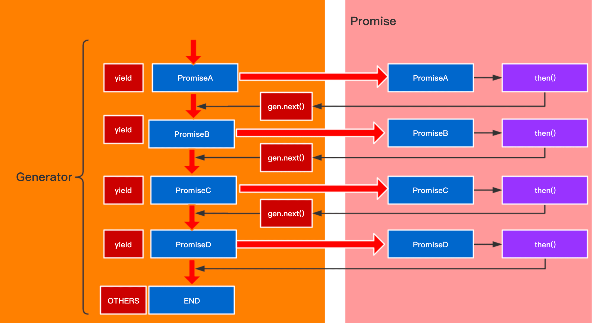

## 你能学到什么

* 如何使用 `Generator` + `Promise` 实现异步编程
* 异步编程的原理解析

<!--truncate-->

## 前言

结合 [上一篇文章](/blog/2024/04/05/index) ，我们来聊聊 `Generator`

## 基础原理

说到异步编程，你想到的是 `async` 和 `await` ，但那也只是 `Generator` 的语法糖而已。[dva](https://dvajs.com/guide/concepts.html#effect) 中有一个 `Effect` 的概念，它就是使用 `Generator` 来解决异步请求的问题，我们也来聊一聊 `Generator` + `Promise` 如何异步编程：

开始之前，我们需要了解一些基本的概念：

* `Generator`作为 `ES6` 中使用协程的解决方案来处理异步编程的具体实现，它的特点是: `Generator` 中可以使用 `yield` 关键字配合实例 `gen` 调用 `next()` 方法，来将其内部的语句分割执行。 简言之 : `next()` 被调用一次，则 `yield` 语句被执行一句，随着 `next()` 调用， `yield` 语句被依次执行。

* `Promise`表示一个异步操作的最终状态（完成或失败），以及其返回的值。参考[Promise-MDN](https://developer.mozilla.org/zh-CN/docs/Web/JavaScript/Reference/Global_Objects/Promise)

所以, 异步编程使用 `Generator` 和 `Promise` 来实现的原理是什么呢？

   1. 因为 `Generator` 本身 `yield` 语句是分离执行的，所以我们利用这一点，在 `yield` 语句中返回一个 `Promise` 对象
   2. 首次调用 `Generator` 中的 `next()` 后, 假设返回值叫 `result` , 那么此时 `result.value` 就是我们定义在 `yield` 语句中的 `Promise` 对象
  
  *注意：在这一步，我们已经把原来的执行流程暂停，转而执行 `Promise` 的内容, 已经实现了控制异步代码的执行，因为此时我们如果不继续执行 `next()` 则 `generator` 中位于当前被执行的 `yield` 后面的内容，将不会继续执行, 这已经达到了我们需要的效果*
  
3. 接下来我们就是在执行完当前 `Promise` 之后，让代码继续往下执行，直到遇到下一个 `yield` 语句:
  *这一步是最关键的*  所以我们怎么做呢:

   步骤1： 在当前的 `Promise` 的 `then()` 方法中，继续执行 `gen.next()`

   步骤2： 当 `gen.next()` 返回的结果 `result.done === true` 时, 我们拿到 `result.value` 【也就是一个新的 `Promise` 对象】再次执行并且在它的 `then()` 方法中继续上面的步骤1，直至 `result.done === false` 的时候。这时候调用 `resolve()` 使 `promise` 状态改变，因为所有的 `yield` 语句已经被执行完。

* 步骤1 保证了我们可以走到下一个 `yield` 语句
* 步骤2 保证了下一个 `yield` 语句执行完不会中断，直至 `Generator` 中的最后一个 `yield` 语句被执行完。
  流程示意图:

  

## 具体实现

> [co](https://github.com/tj/co) 是著名大神 [TJ](https://twitter.com/tjholowaychuk) 实现的 `Generator` 的二次封装库，那么我们就从 `co` 库中的一个demo开始，了解我们的整个异步请求封装实现：

```javascript
co(function*() {
    yield me.loginAction(me.form);
    ...
});
```

在这里我们引入了 `co` 库，并且用 `co` 来包裹了一个 `generator` （生成器）对象。
接下来我们看下 `co` 对于包裹起来的 `generator` 做了什么处理

```javascript
function co(gen) {
    // 1.获取当前co函数的执行上下文环境,获取到参数列表
    var ctx = this;
    var args = slice.call(arguments, 1);
    // 2.返回一个Promise对象
    return new Promise(function(resolve, reject) {
        //  判断并且使用ctx:context(上下文环境)和arg:arguments(参数列表)初始化generator并且复制给gen
        // 注意:
        // gen = gen.apply(ctx, args)之后
        // 我们调用 gen.next() 时，返回的是一个指针，实际的值是一个对象
        // 对象的形式：{done:[false | true], value: ''}
        if (typeof gen === 'function') gen = gen.apply(ctx, args);
        // 当返回值不为gen时或者gen.next的类型不为function【实际是判断是否为generator】时
        // 当前promise状态被设置为resolve而结束
        if (!gen || typeof gen.next !== 'function') return resolve(gen);
        // 否则执行onFulfilled()
        onFulfilled();
    });
}
```

总结一下这里发生了什么

1. 返回一个 `promise`
2. `promise` 中将被包裹的 `generator` 实例化为一个指针，指向 `generator` 中第一个 `yield` 语句
3. 判断 `generator` 实例化出来的指针是否存在：如果没有 `yield` 语句则指针不存在
   判断指针 `gen.next()` 方法是否为 `function` ：如果不为 `function` 证明无法执行 `gen.next()`

   条件有一项不满足就将 `promise` 的状态置为 `resolve`

   否则执行 `onFulfilled()`

接下来我们看下 `onFulfilled()` 的实现

```javascript
    function onFulfilled(res) {
        // 在执行onFulfilled时，定义了一个ret来储存gen.next(res)执行后的指针对象
        var ret;
        try {
            ret = gen.next(res);
            // 在这里，yield语句抛出的值就是{value:me.loginAction(me.form), done:false}
        } catch (e) {
            return reject(e);
        }
        // 将ret对象传入到我们定义在promise中的next方法中
        next(ret);
        return null;
    }
```

总结一下， `onFulfilled` 最主要的工作就是

1. 执行 `gen.next()` 使代码执行到 `yield` 语句
2. 将执行后返回的结果传入我们自定义的 `next()` 方法中

那么我们再来看 `next()` 方法

```javascript
    function next(ret) {
        // 进入next中首先判断我们传入的ret的done状态:
        // 情况1:ret.done = true 代表我们这个generator中所有yield语句都已经执行完。
        // 那么将ret.value传入到resolve()中，promise的状态变成解决，整个过程结束。
        if (ret.done) return resolve(ret.value);
        // 情况2:当前ret.done = false 代表generator还未将所有的yield语句执行完，那么这时候
        // 我们把当前上下文和ret.value传入toPromise中，将其转换为对应的Promise对象`value`
        var value = toPromise.call(ctx, ret.value);
        if (value && isPromise(value)) return value.then(onFulfilled, onRejected);
        // 当value确实是一个promise对象的时候，return value.then(onFulfilled,onRejected)
        // 我们重新进入到了generator中，执行下一条yield语句
        return onRejected(new TypeError('You may only yield a function, promise, generator, array, or object, ' +
            'but the following object was passed: "' + String(ret.value) + '"'));
    }
```

总结一下， `next` 主要工作

1. 判断上一次 `yield` 语句的执行结果
2. 将 `yield` 的 `result` 的 `value` 值【其实就是我们要异步执行的 `Promise` 】
3. 执行 `value` 的 `then` 方法，重新进入到 `onFulfilled` 方法中，而在 `onFulfilled` 中，我们又将进入到当前方法，如此循环的调用，实现了 `generator` 和 `Promise` 的执行切换，从而实现了 `Promise` 的内容按照我们所定义的顺序执行。

有同学可能对这里的 `toPromise` 方法有一些疑惑，我先把代码贴出来

```javascript
function toPromise(obj) {
    if (!obj) return obj;
    if (isPromise(obj)) return obj;
    if (isGeneratorFunction(obj) || isGenerator(obj)) return co.call(this, obj);
    if ('function' == typeof obj) return thunkToPromise.call(this, obj);
    if (Array.isArray(obj)) return arrayToPromise.call(this, obj);
    if (isObject(obj)) return objectToPromise.call(this, obj);
    return obj;
}
```

其实这个函数做的事情就是，根据不同的类型进行转换，使得最后输出的类型都是一个 `Promise` 。那具体的转换细节，大家可以参考[co库的源码](https://github.com/tj/co/blob/master/index.js)。

至此实现异步操作的控制。
