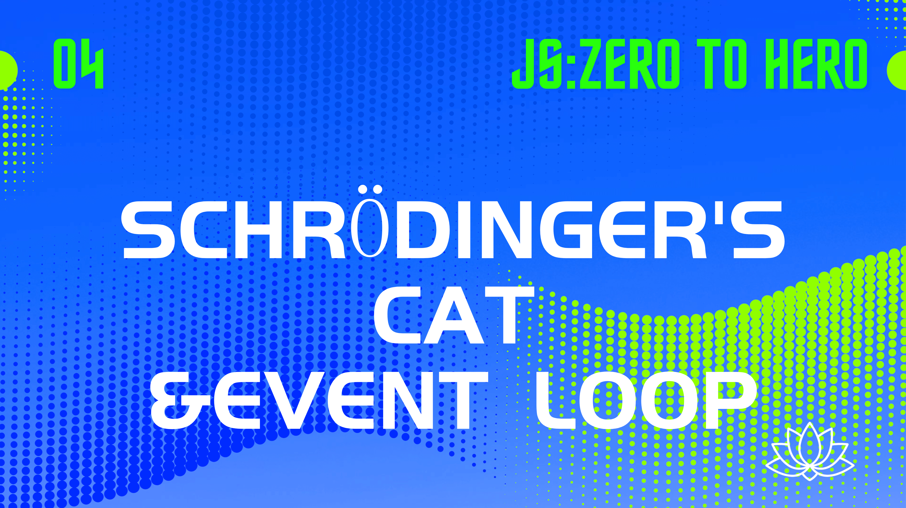
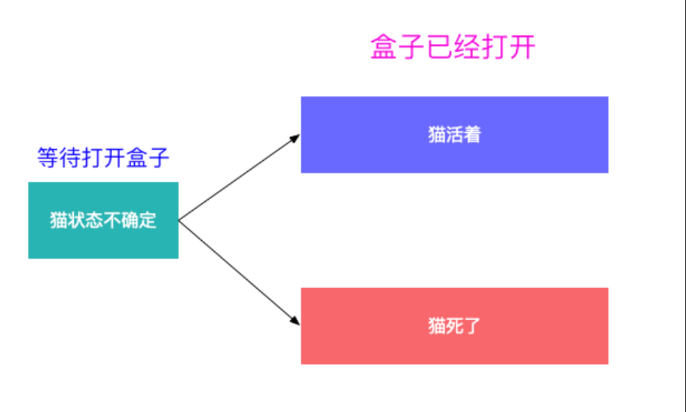
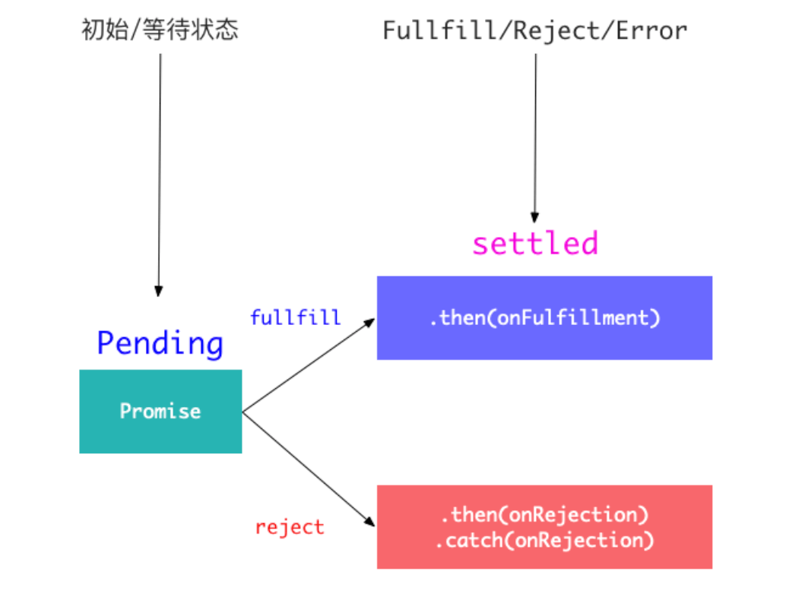
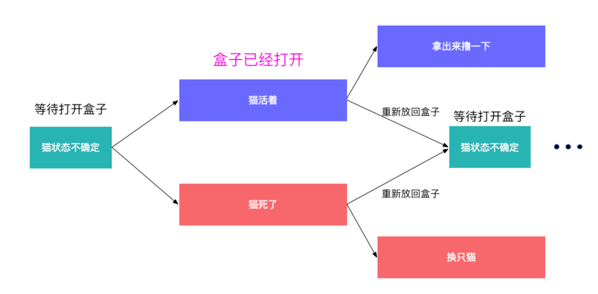
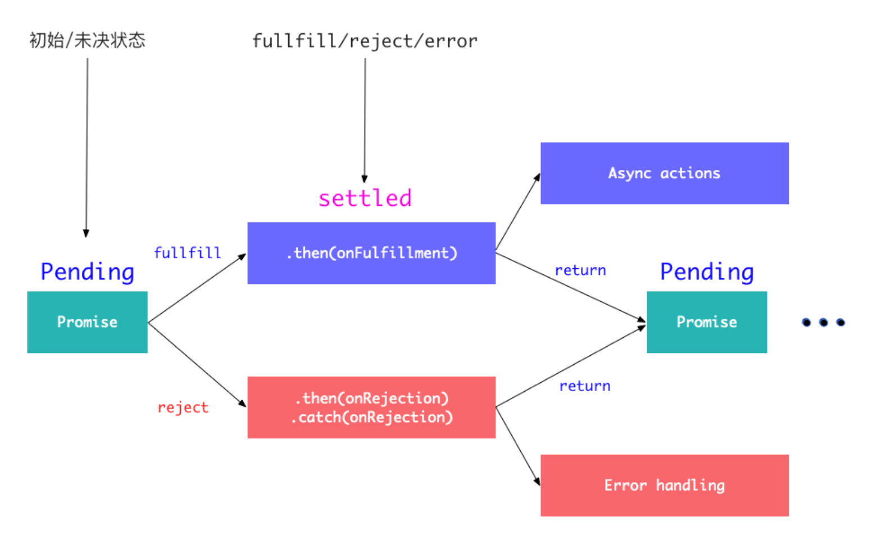
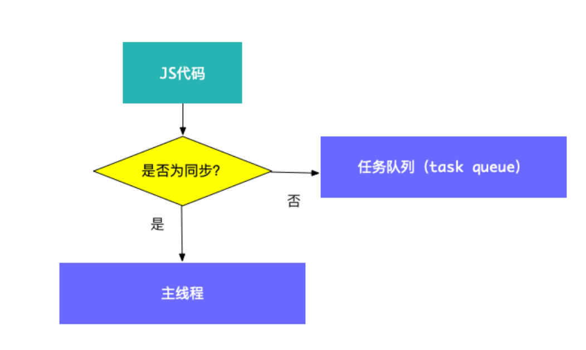
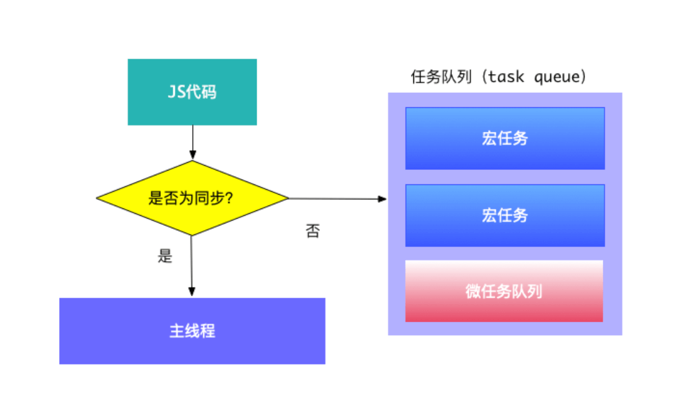
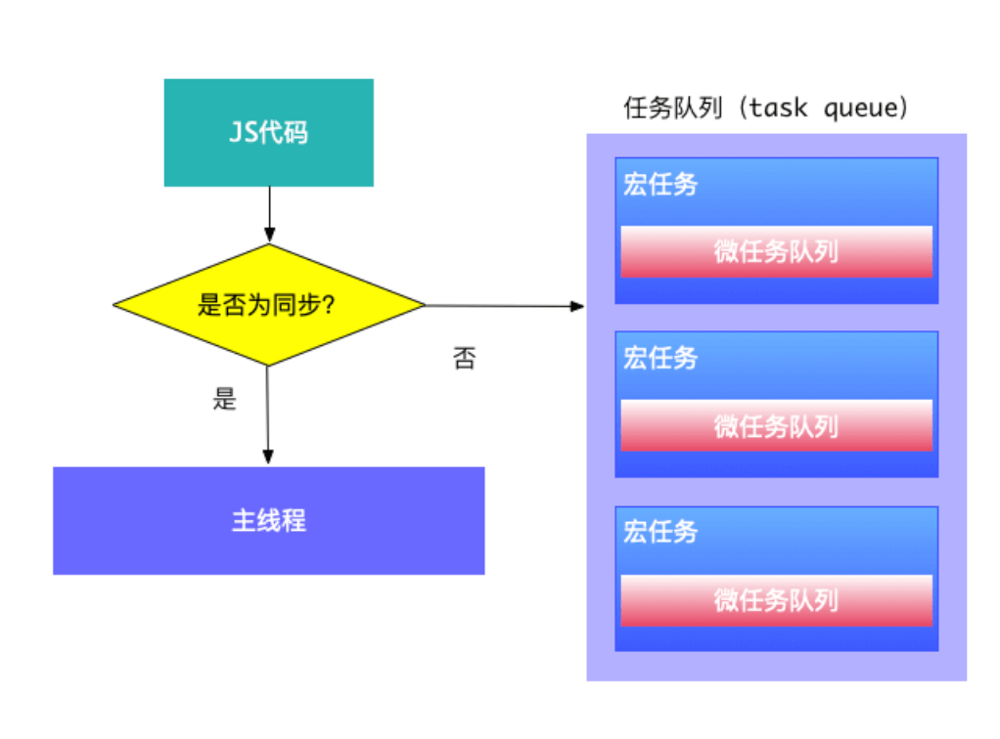
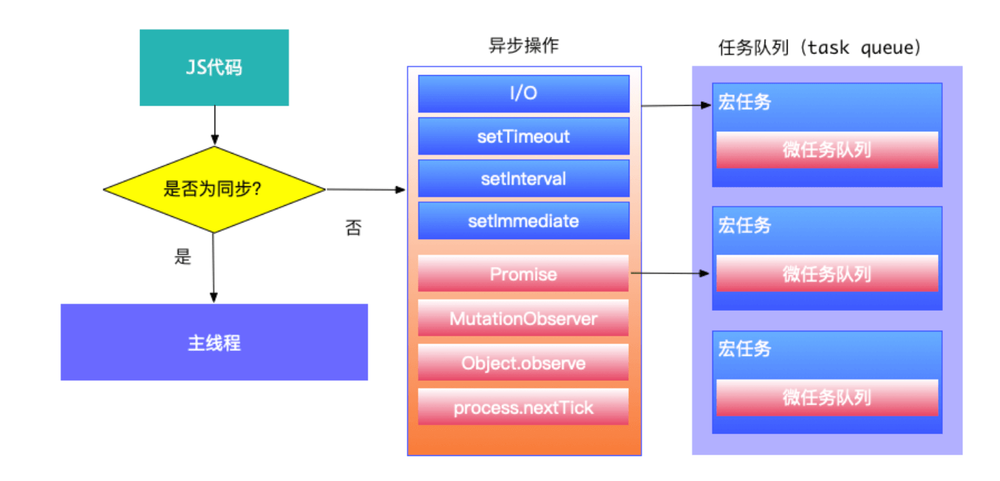
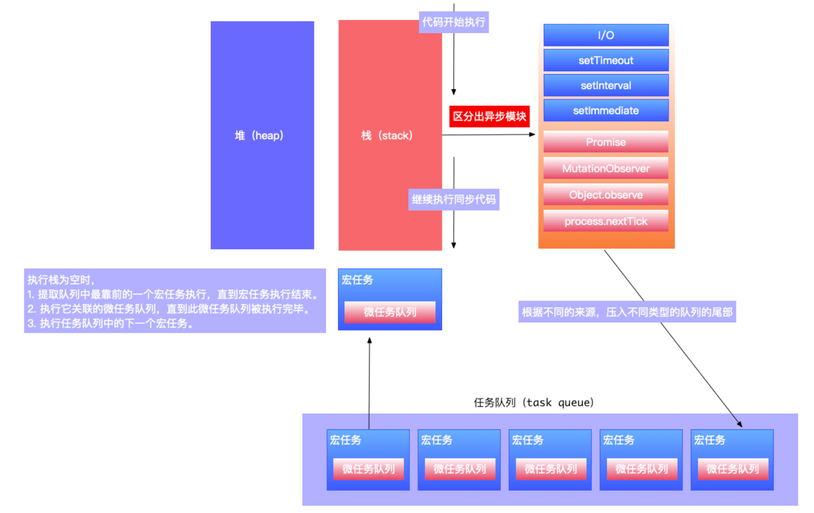

## 前言

[上一篇文章](/blog/2024/04/07/index)我们从高阶函数聊到了 `promise` ，这次我们聊聊:

* 从 `promise A+` 规范和 `promise` 应用来看 `promise` 的特性
* `promise` 和 eventloop 的关系

<!--truncate-->

## 从薛定谔的猫（Erwin Schrödinger's Cat）来理解 promise

薛定谔的猫是奥地利著名物理学家薛定谔提出的一个思想实验，那么这和 `promise` 有什么关系呢？在这个著名的实验中，假设在盒子里会有一只猫，然后我们打开盒子只会出现两个结果，猫死了或者是活着：



那么 `promise` 也类似，根据 [promise A+ 规范](https://malcolmyu.github.io/2015/06/12/Promises-A-Plus/#%E6%89%A7%E8%A1%8C%E6%80%81%EF%BC%88Fulfilled%EF%BC%89) 当一个 `promise` 被创建出来以后，它就拥有三种可能状态 *Pending* (初始时为 *pending*)/ *Fulfilled* /  *Rejected* 如果我们把范围放宽一点，那么 *Fulfilled* /  *Rejected* 又可以被称为 *Settled*：



okay，相信你已经理解了 `promise` 的三种状态，那细心同学看到上面有 `then()` 和 `catch()` 这样的方法可能不理解，我们再回到上面猫的例子里面，现在这个科学家比较变态，在第一次实验之后，猫出现了两种状态，但是他并没结束实验，而是针对这两种情况做了处理并继续了实验：



与之类似，一个完整的 `promise` ，在 *Pending* 状态发生变化时，只可能是两种情况，*Fulfilled* 和 *Rejected*，并且我们可以看到箭头是单向的，意味着这个过程是 **不可逆** 的。

这意味着，当 `Pending` 状态发生了变化，无论是变成 `Fulfilled` 还是 `Rejected` 都无法再改变了。



针对这两种情况，我们在 `then()` 里面可以传入两个回调函数 `onFulfillment` 和 `onRejection` 作为来处理不同的情况。

从图中我们可以看到，当 `onFulfillment` 时，我们通常会做一些异步的操作，而 `onRejection` 通常是做错误处理。然后我们把当前的 `promise` 重新返回，直到下次他的 `then()` 再次被执行。

一个 `promise.then().then().then()` 这样的方式就是我们 [上一篇文章](/blog/2024/04/07/index) 中所说的 **链式调用**。

## 通过 promise 的执行来看特性

通过上一节，我们已知 `promise` 本身的几个特性:

* `promise` 有三种状态: *Pending* (初始时为 *pending*)/ *Fulfilled* /  *Rejected*。
* `promise` 状态的转变是不可逆的： *Pending* -> *Fulfilled* 或者 *Pending* -> *Rejected* 。
* `promise` 支持 `then()` 的链式调用。

但是还有一些特性，我们需要从代码的角度来分析。

### 1. 创建后，立即执行

因为 `promise` 原意为承诺，也就是我预先承诺了将来要达成的一件事情。

所以有同学会认为必须等到承诺兑现，也就是 `promise` 的状态从 `Pending` 变为 `Fulfilled` 或者 `Rejected` 时，其构造函数接收的函数才会被执行。

但是实际上，一个 `promise` 被创建时，即使我们没有定义 `then()` , 其构造函数接收的函数也会立即执行：

```javascript
let p = new Promise((resolve, reject) => {
    console.log('A new promise was created1')
    console.log('A new promise was created2')
    console.log('A new promise was created3')
    setTimeout(() => {
        console.log('log setTimeout')
    }, 3000)
    resolve('success')
})

console.log('log outside')
```

输出结果：

```bash
A new promise was created1
A new promise was created2
A new promise was created3
log outside
log setTimeout
```

### 2. 异常处理的方式

根据 [promise A+ 规范](https://malcolmyu.github.io/2015/06/12/Promises-A-Plus/#%E6%89%A7%E8%A1%8C%E6%80%81%EF%BC%88Fulfilled%EF%BC%89) ， `promise` 的 `then()` 接收2个参数:

```javascript
promise.then(onFulfilled, onRejected)
```

其中 `onFulfilled` 执行结束后调用， `onRejected` 拒绝执行后调用，看看这段代码：

```javascript
let p = new Promise((resolve, reject) => {
    reject('reject')
    //throw 'error'
})

p.then(
    data => {
        console.log('1:', data)
    },
    reason => {
        console.log('reason:', reason)
    }
)
```

最后打印的是：

```bash
reason: reject
```

可以正常运行不是吗？但是我们发现实际应用中，我们并没有这样来定义 `then()` ：

```javascript
p.then(
    data => {
        console.log('1:', data)
    },
    reason => {
        console.log('reason1:', reason)
    }
).then(
    data => {
        console.log('2:', data)
    },
    reason => {
        console.log('reason2:', reason)
    }
).then(
    data => {
        console.log('3:', data)
    },
    reason => {
        console.log('reason3:', reason)
    }
)
```

而是使用 `catch()` 配合 `onFulfilled()` ：

```javascript
p.then(data => {
    console.log('1:', data)
}).then(data => {
    console.log('2:', data)
}).then(data => {
    console.log('3:', data)
}).catch(e => {
    console.log('e2:', e)
})
```

表面上看，达到的效果是一样的，所以这样有什么好处呢？

1. 减少代码量。
2. 在 `onFulfilled()` 中如果发生错误，也会进行捕获，不会中断代码的执行。

### 3. then() 是异步执行的

看一段代码：

```javascript
let p = new Promise((resolve, reject) => {
    console.log('A new promise was created1')
    console.log('A new promise was created2')
    console.log('A new promise was created3')
    resolve('success')
})
console.log('log outside')

p.then(data => {
    console.log('then:', data)
})
```

执行结果：

```bash
A new promise was created1
A new promise was created2
A new promise was created3
log outside
then: success
```

我们可以很清楚的看到， `then()` 中打印的内容是在最后的，为什么会这样呢？因为 `p.then()` 中传入的函数会被推入到 `microtasks` (异步任务队列的一种) 中，而任务队列都是在执行栈中的代码（同步任务）之后处理。

下面这些代码都在同步任务中处理:

```JavaScript
console.log('A new promise was created1')
console.log('A new promise was created2')
console.log('A new promise was created3')
console.log('log outside')
```

okay 看到这里你可能会有一些问题，例如：

* 什么是 *同步任务* ? 
* 什么是 *执行栈*?
* 什么是 *microtasks*？
* 什么是 *异步任务队列*？

要明白这些，就不得不聊聊 Event loop。

##  Event loop 是什么？为什么我们需要 Event loop？

在 [W3C文档](https://www.w3.org/TR/html5/webappapis.html#event-loops) 中我们可以找到关于它的描述：

> To coordinate events, user interaction, scripts, rendering, networking, and so forth, user agents must use event loops as described in this section. There are two kinds of event loops: those for browsing contexts, and those for workers.

翻译一下就是：

> 客户端必须使用本章节中所描述的事件循环，来协调事件，用户交互，脚本，呈现，网络等等。 事件循环有两种：用于浏览上下文的事件循环和用于 worker 的事件循环。

我们写好一段 JavaScript 代码，然后浏览器打开这个页面，或者在 `node` 环境中运行它，就可以得到我们期望的结果，但是这段代码怎么执行的呢？

很多同学都知道，是 `JavaScript` 引擎在执行代码，而 `JavaScript` 引擎都是依托于一个宿主环境的，最通用的 `JavaScript` 宿主环境是浏览器。

这和 *EventLoop* 有什么关系呢？

因为宿主环境是浏览器，所以 `JavaScript` 引擎被设计为单线程。

为什么不能是多线程呢？举个例子：加入我们同时两个线程都操作同一个 `DOM` 元素，那应该如何处理呢？对吧。

okay，既然是单线程，意味着我们只能顺序执行代码，但是如果我们执行某一行特别耗费时间，是不是在这行后面的内容就被阻塞了呢？

所以我们需要在单线程的引擎中来实现异步，而 *Event loop* 就是实现异步的关键。

## Event loop 中的任务队列 & 宏任务 & 微任务

首先当一段代码给到 JavaScript 引擎的时候，会区分这段代码是同步还是异步：

* 同步的代码进入主线程执行
* 异步的代码加入到任务队列中，等待主线程通知执行



异步的代码加入到任务队列中，而任务队列又分为 *宏任务队列(macro tasks)* 和 *微任务队列(micro tasks)*。

一个浏览器的上下文环境可能对应有多个宏任务队列但是只有一个微任务队列。你可能觉得会是这样：



但是实际上，每个宏任务都包含了一个微任务队列：



那么问题来了，我们怎么去判断这段代码要加入到宏任务队列，还是微任务队列中呢？

我们参考下文档中的解读：

> Each task is defined as coming from a specific task source. All the tasks from one particular task source and destined to a particular event loop 

> 每个任务都由特殊任务源来定义。 来自同一个特殊任务源的所有任务都将发往特定事件循环

所以我们可以按照不同的来源进行分类，不同来源的任务都对应到不同的任务队列中

* （macro-task 宏任务）来源：`I/O`,  `setTimeout + setInterval + setImmediate`,  `UI renderder`  ···
* （micro-task 微任务）来源：`Promise` ，`process.nextTick` ，`MutationObserver`,  `Object.observe` ···



明白了这些概念之后，我们来看看完整的执行过程。

## Event loop 完整的执行过程

下图参考了 [Philip Roberts的演讲](https://vimeo.com/96425312) PPT同时加深和细化：



图的顺序从上往下看：

1. 代码开始执行，`JavaScript` 引擎对所有的代码进行区分。
2. 同步代码被压入栈中，异步代码根据不同来源加入到宏任务队列尾部，或者微任务队列的尾部。
3. 等待栈中的代码被执行完毕，此时通知任务队列，执行位于队列首部的宏任务。
4. 宏任务执行完毕，开始执行其关联的微任务。
5. 关联的微任务执行完毕，继续执行下一个宏任务，直到任务队列中所有宏任务被执行完毕。
6. 执行下一个任务队列。

步骤 `3 - 4 - 5` 就是一个事件循环的基本原理。