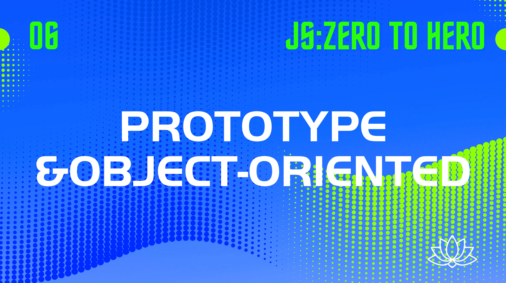

## 前言

开头说点题外话，不知道什么时候开始，我发现在 JavaScript 中，大家都喜欢用 foo 和 bar 来用作示例变量名，为此专门查了一下这家伙的 [来源](https://en.m.wikipedia.org/wiki/Foobar)：

*“The etymology of foo is obscure. Its use in connection with bar is generally traced to the World War II military slang FUBAR, later bowdlerised to foobar. ... The use of foo in a programming context is generally credited to the Tech Model Railroad Club (TMRC) of MIT from circa 1960.”*

foo的词源是模糊的。 它与bar的关系可以追溯到第二次世界大战的军事俚语 `FUBAR` ，后简化为foobar。 而在编程环境中使用 `foo` 通常认为起源于约 1960 年时麻省理工学院的技术模型铁路俱乐部（TMRC）。

<!--truncate-->

okay ，那么今天，我们也看看这段 `Foo` 的代码来聊聊原型。

```javascript
function Foo(name) {
    this.name = name
}

let foo = new Foo('demoFoo')

console.log(foo.name) // demoFoo
```

## 1. 为什么 JavaScript 被设计成基于原型的模式？

大家都知道 `Java` 作为面向对象的语言的三个要素： `封装` ， `继承` ， `多态` ，我之前也写过 `Java` ，所以在一开始学习 `JavaScript` 的时候，我总是会去通过类比熟悉的 `Java` 来理解 `JavaScript` 中关于继承的概念，但是无论怎么去类比都觉得不是那么回事，因为这本身就是两种完全不同的方式。

`JavaScript` 是如何设计出来的呢，[wiki](https://en.wikipedia.org/wiki/JavaScript
) 是这样说的

*“网景决定发明一种与 Java 搭配使用的辅助脚本语言，并且语法上有些类似”*

不管怎么说， `JavaScript` 在设计之初都受到了 `Java` 的影响，所以在 `Javascript` 中也有了对象的概念，但是作为一种 **辅助脚本语言** ，类的概念有些过于笨重，不够简单。但是对象之间需要一种让彼此都产生联系的机制，怎么办呢？

依旧是参考了 `Java` 的设计， `Java` 中生成一个对象的语法是这样：

```java
Foo foo = new Foo() // 请注意这里的Foo 指的是类名，而不是构造函数。
```

于是 Brendan Eich 也模仿了这样的方式使用了 `new` 来生成对象，但是 `JavaScript` 中的 `new` 后面跟的不是 `Class` 而是 `Constructor` 。

okay 解决了实例化的问题，但是仅仅只靠一个构造函数，当前对象无法与其他的对象产生联系，例如有的时候我们期望共享一些属性：

```javascript
function People(age) {
    this.age = age
    this.nation = 'China'
}

// 父子大小明
let juniorMing = new People(12)
let seniorMing = new People(38)

// 有天他们一起移民了，此时我想改变他们的国籍为 America
juniorMing.nation = 'America'
// 但是改变小明一人的国籍并不能影响大明的国籍
console.log(seniorMing.nation) // China
```

(nation)国籍 在这个例子中成为了我们想在两个对象之间共享的属性，但是由于没有类的概念，必须得有一个新的机制来处理这部分 **需要被共享的属性**。这就是 prototype 的由来。

所以我们上面的例子变成了什么呢？

```javascript
function People(age) {
    this.age = age
}

People.prototype.nation = 'China'

// 父子大小明
let juniorMing = new People(12)
let seniorMing = new People(38)

// 有天他们一起移民了，此时我想改变他们的国籍为 America
People.prototype.nation = 'America'

console.log(seniorMing.nation) // America
console.log(juniorMing.nation) // America
```

## 2.  最简单的原型

结合前言部分中的代码：

```javascript
function Foo(name) {
    this.name = name
}

let foo = new Foo('demoFoo')

console.log(foo.name) // demoFoo
```

先提取一下关键信息：

* `foo` 是被构造出来的实例对象。
* `foo` 的构造方法是 `Foo()`

所以最基础的原型链就是这样：


> 在这个例子中 `Constructor.prototype` 等价于 `Foo.prototype`

构造函数 `Foo` 可以通过 `Foo.prototype` 来访问原型，同时被构造出来的对象 `foo` 也可以通过 `foo.__proto__` 来访问原型：

```javascript
Foo.prototype === foo.__proto__ // true
foo.__proto__.constructor === Foo // true
```

简单的来说， `Foo` 函数，参照了 `Foo.prototype` 生产出来了一个 `foo` 对象。

为了更好的理解这一过程，我得从一个故事开始说起：

* 在很久很久很久以前，有一个工匠偶然间看到了一个很美的古迹雕像（原型 `Foo.prototype`）
* 他想通过批量的生产复刻的版本来发家致富，于是他先分析雕像，还原了制造的过程，并且设计出一条生产线（构造器 `Foo`）
* 然后通过这个构造器，可以源源不断的造出许多的复刻雕像（实例 `foo`）。

## 3. 原型链

刚刚的故事还没有结束，后来一天这个工匠开始思考，之前看到的那个雕塑是哪里来的呢？又是怎么做出来的呢？就算是天然形成的，那又是什么条件形成了这样的雕塑呢？

带着这些问题，他开启了 996 模式，寻师访友，查阅典籍，经历了多年苦心研究，终于有了新的发现：

#### ① 原来他作为参照物（原型）的雕像 ( `Foo.prototype` / `foo.__proto__` ) 是 n 年前一位雕刻大师参照自然的现象（ `Object.prototype` ）然后设计了铸造方式( `Object()` )造出来的

从代码来看：

```javascript
foo.__proto__.__proto__ === Object.prototype //true

Foo.prototype.__proto === Object.prototype //true

Object === Object.prototype.constructor
```

用图来描述这一过程就是：


#### ② 除此之外，他发现，原来这位雕刻大师设计的铸造方式( `Object()` )，是根据自然现象的**形成规律**( `Function.prototype` )来设计的。所以，本质上来说，他所设计出的生产线( `Foo()` )，也**间接**的参考了自然现象的**形成规律**( `Function.prototype` )

```JavaScript
console.log(Object.__proto__ === Function.__proto__)
console.log(Foo.__proto__ === Function.prototype)
```

然后我们来看看图会更加清晰一些：


#### ③ 故事到这里还没有结束，这位工匠发现，原来，对于自然现象形成规律的描述( `Function.prototype` )是先辈们从这自然现象( `Object.prototype` )中总结出来的

所以我们从代码中看到：

```javascript
Function.prototype.__proto__ === Object.prototype
```

所以 *人法地、地法天、天法道、道法自然*，现在我们可以看到完整的原型链：


#### ④ 故事并没有像我们想象中那样结束，这位工匠最后改良了生产链，结合了先人的方式和关于这一自然现象的规律，重新定义了关于这一规律的描述

所以代码被改写为：

```javascript
let foo = new Object()
console.log(foo.__proto__ === Object.prototype) // true
```

而这一故事也一直流传到今天：


## 4. 原型继承

看到这里，相信你对 JavaScript 中的原型和原型链，都有了新的认识，那么我们再来聊聊原型继承，在聊原型继承之前，我们想想什么叫做继承呢?

抛开计算机中的理论，我们就说一个最简单的例子，小王通过继承了他老爸的遗产走上了人生巅峰。这里面其实有一个关键信息：他老爸的遗产帮助他更快的走上了人生巅峰，换言之，小王不需要自己努力也能通过他老爸留下的财产走上人生巅峰。

听起来很像是废话，但是本质也在这里：

* 我们定义了一个新的对象 `child`
* 但是我们并不想再帮他定义其他复杂的属性
* 所以我们选择了一个之前定义过的构造函数 `parents` 然后让 `child` 直接从 `parents` 那里把所有东西都继承过来。
* 在 `parents` 的基础上，我可能为 `child` 定制了一些内容，所以以后有可能直接从 `child` 来继承这一切。

听起来继承就像是 **让一个普通的对象快速的获得原本不属于它的超能力。**

> 蝙蝠侠的故事告诉我们：rich 也是一种超能力。

okay 让我们看看怎么样让 JavaScript 中的对象快速获得超能力呢？结合我们上面了解的内容，我们会发现几个很关键的点，如果要让一个对象获得超能力，只有下面的三种途径：

1. 因为对象是由 `constructor` 生产的，所以我们可以通过改变 `constructor` 来实现。
2. `constructor` 有一个关键的属性： `constructor.prototype` 所以改变原型也能达到目的。
3. 直接改变对象的属性，将要添加的内容复制过来。

无论你怎么去找继承的方法，继承的本质就在这里，领悟本质会让问题变得简单，所以我们一起来看看具体的实现。

### 改写构造函数

我们从最简单的开始，这种方式的核心就在于直接在当前构造函数中，调用你想继承的构造函数。

```javascript
function Student() {
    this.title = 'Student'
}

function Girl() {
    Student.call(this)
    this.sex = 'female'
}

let femaleStudent = new Girl()

console.log(femaleStudent)
```

这种方式并没有影响到你的原型链，因为本质上来说，你还是通过 `Girl()` 来生成了一个对象，并且 `Girl.prototype` 也并未受到影响，所以原型链不会产生变化。

### 改变 constructor.prototype

改变 constructor.prototype 这一方式有不同的情况，我们可以分开来看

#### ① chidConstructor.prototype = new Parents()

这种方式的核心已经写在了标题上，所以我们来看看代码吧：

```javascript
function Parent() {
    this.title = "parent"
}

function Child() {
    this.age = 13
}
const parent = new Parent()
Child.prototype = parent
const child = new Child()
console.log(child);
console.log('child.__proto__.constructor: ', child.__proto__.constructor);
console.log('parent.constructor: ', parent.constructor); //每一个实例也有一个constructor属性，默认调用prototype对象的constructor属性
```

打印出来是什么呢？


把他和原本没有继承之前的 `child` 对比一下:


结论是：

* 当前对象的原型已经被重置为一个 parent 对象
* 当前对象的构造方法由 Child() 变成了 Parent()
* 原本的 `child.prototype` 被替换为 `parent` 对象后与构造器之间的联系成为了单向:

```javascript
console.log(parent.constructor.prototype === parent) //false
```

我们用图来描述一下:


为了解决上面存在的问题，我们改写了代码，添加了一行

```javascript
...
const parent = new Parent()
Child.prototype = parent
Child.prototype.constructor = Child; //添加了这行
const child = new Child()
    ...
```

所以原型链成为下面这样：


有的同学可能会不理解为什么 `Child.prototype === parent` 以及 `parent.constructor === Child()`

`Child.prototype === parent` 是因为我们在代码中中强行设置了， `parent.constructor === Child()` 是因为 `parent` 对象本身也有一个 `constructor` 属性，这个属性默认返回 `parent.__proto__.constructor` 所以之前是 `Parent()` 但是现在也被代码强制设置为了 `Child()`

```javascript
Child.prototype = parent
Child.prototype.constructor = Child; // parent.constructor === Child
```

#### ② 方法 ① 和 改变构造函数的组合

我们把前面两种方式组合起来：

```javascript
 function Parent() {
     this.title = "parent"
 }

 function Child() {
     Parent.call(this)
     this.age = 13
 }
 const parent = new Parent()
 Child.prototype = parent
 Child.prototype.constructor = Child;
 const child = new Child()
 console.log(child);
```

打印的结果是：


这样我们生成的 `child` 对象本身包含了他从 `Parent` 中继承来的 `title` 属性，但是同时 `Child.prototype` 同时也包含了所有 `Parent` 上的所有属性，造成内存的浪费:


#### ③ 方法 ② 组合改进

所以我们把方法 ② 改变一下，避免内存的浪费，既然原因是因为我们将 `Child.prototype` 设置为 `new Parent()` 的过程中，使用 `Parent()` 进行实例化所以将属性都继承到了 `Child` 原型上，那么为什么不可以直接使用原型对原型进行赋值呢？

也就是 `chidConstructor.prototype = Parents.prototype` ：

```javascript
function Parent() {
    this.title = "parent"
}

function Child() {
    Parent.call(this)
    this.age = 13
}
Child.prototype = Parent.prototype
Child.prototype.constructor = Child;
const child = new Child()
console.log(child);
```

我们看下打印信息：


okay, 关键的信息看起来都很完美，再分析下原型链:


嗯，单纯站在 child 的角度来看好像没有什么问题，但是如果我们打印下面这几行会发现问题：

```javascript
console.log('parent: ', new Parent());
console.log(Child.prototype === Parent.prototype) //true
```


`Parent.prototype` 的构造器变成了 `Child` 是不合理的，而且此时 `Child.prototype === Parent.prototype` 两个属性指向同一个对象，当我们改变 `Child.prototype` 的时候，我们并不希望影响到 `Parent.prototype` 但是在这里成为了不可避免的问题。

那有什么办法可以解决这个问题呢？

#### ④ 拷贝 prototype

如果我们并不直接将 `Parent.prototype` 赋值给 `Child.prototype` 而是复制一个一模一样的新对象出来替代呢？

```javascript
function Parent() {
    this.title = "parent"
}

function Child() {
    Parent.call(this)
    this.age = 13
}
Child.prototype = Object.create(Parent.prototype)
Child.prototype.constructor = Child; //我们在这里修改了构造器的指向，你同样可以在Object.create 方法中做这件事。
const child = new Child()
console.log('parent: ', new Parent());
console.log(child);
```

最后打印出来的结果如何呢？


没有任何问题，避免了父子原型的直接赋值导致的各种问题~

#### ⑤  空对象法

除了上面的解决方案，还有没有别的办法呢？答案是有的，除了通过复制创造一个新的原型对象，我们还可以用一个中间函数来实现这件事：

```javascript
...
function extend(Child, Parent) {
    var X = function() {};
    X.prototype = Parent.prototype;
    Child.prototype = new X();
    Child.prototype.constructor = Child;
}
...
```


同样很完美。这也是 [YUI](https://yuilibrary.com/) 库实现继承的方式。

### 直接改变对象的属性

我们不再基于原型去玩什么花样，而是直接把整个父对象的属性都拷贝给子对象。如果仅仅是值类型的话，是没有问题的，但如果这时候，父对象的属性中原本包含的是引用类型的值呢？

我们就要考虑把整个引用类型的属性拷贝一份到子对象，这里就设计到浅拷贝和深拷贝的内容啦~
