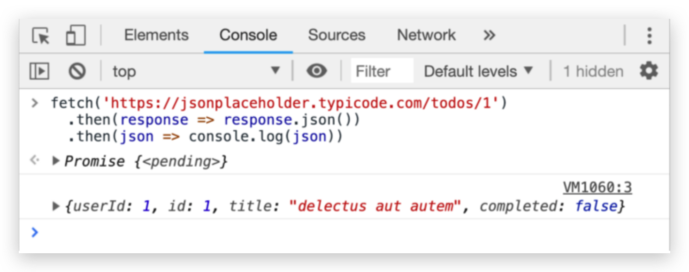
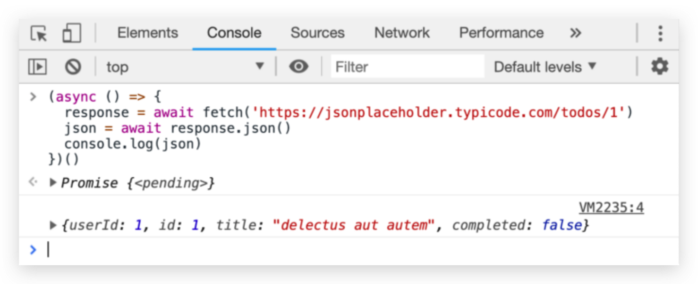
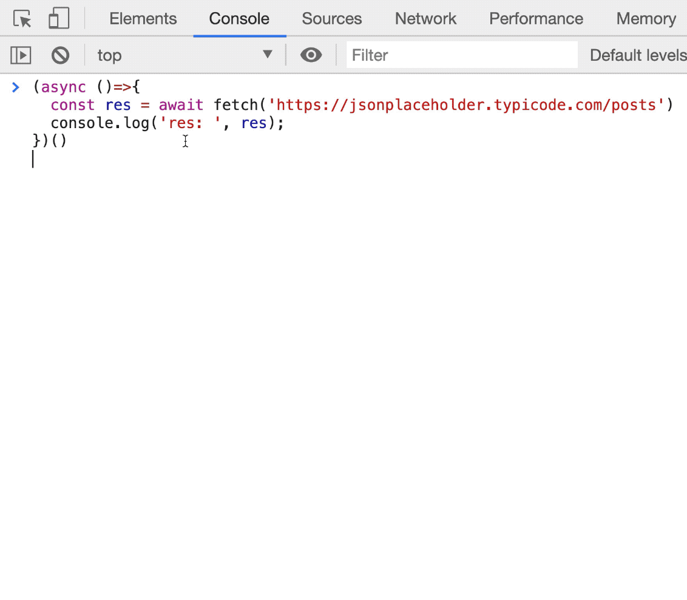
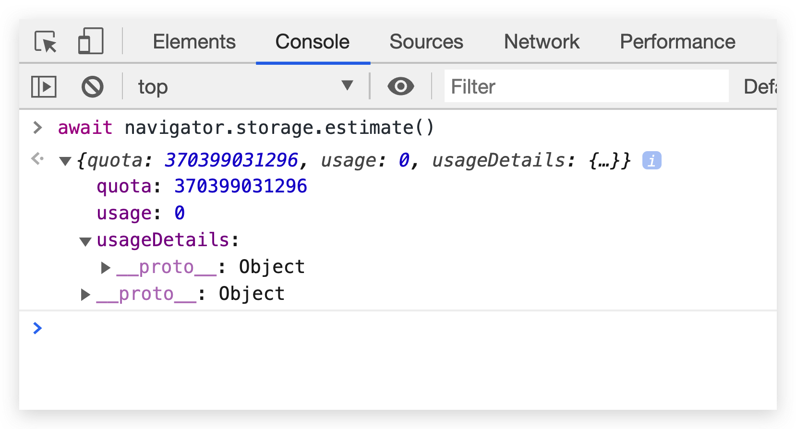
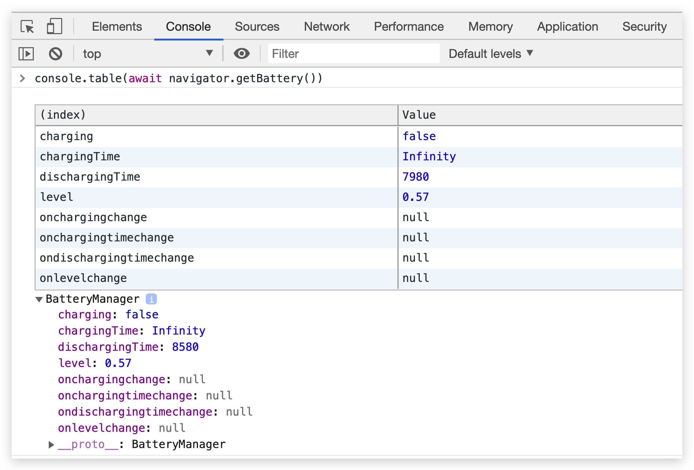

:::tip 问题
与浏览器有关的 API 大部分都基于 `Promise` , 但在 `Console` 面板用起来很不方便。有没有使用的技巧呢？
:::

### 1.例子

我们在 `JavaScript/TypeScript` 中使用 `promise` 的时候，通常会配套使用 `.then` ，但如果在 `Console` 面板中敲起来很不方便：
 


或者这样



试一试吧，大多数时候，代码会在输入完成之前误触发，或者漏写括号报错...

**但如果 `console` 默认就被 `async` 包裹呢？**：



事实上, 在 `Console` 中使用 `promise` 比在 JavaScript 中使用起来还要简单！

你可能觉得 `fetch` 的例子很无聊，下面我们来看看更有意思的：

### 2.`Storage` 系统的 **占用数** 和 **空闲数**

``` javascript
await navigator.storage.estimate()
```



### 3.设备的 **电池信息**

为了达到更好的效果，我们将这个技巧和前几天中提到的 `console.table` 来合并使用：

敲黑板：这是一条[不推荐使用的API](https://developer.mozilla.org/en-US/docs/Web/API/Battery_Status_API), 尽管看起来这么酷炫...



### 4.媒体能力

`Media Capabilities` 让开发者获取到用户设备/系统/浏览器解码能力的信息，作为前端工程师在为用户选择媒体流时可以做出最佳决策：


:::tip 敲黑板
你可以阅读 w3c 相关的[文档](https://w3c.github.io/media-capabilities/)来了解更多媒体能力的信息
:::


### 5.Cache storage

在对这个特性进行演示之前，还得聊聊什么是 [Cache storage](https://developer.mozilla.org/en-US/docs/Web/API/CacheStorage)。

> 这里花些篇幅简单聊聊，因为有的同学可能没接触过，（如果你已经了解可以跳过）。

首先我们用到的 `Cache` 以及 `Cache storage` 都是 `Service Worker` 的 API。

`Cache` 这个词本身是缓存的意思，什么时候需要用到缓存呢？

缓存视频是为了在没有网络的时候不影响你的观看体验。浏览器的缓存也一样，在设备处于离线状态时，给用户更好的体验。

有个词叫 “离线开发” 说的就是这么一回事。(H5 有个 [manifest 缓存技术](https://en.wikipedia.org/wiki/Cache_manifest_in_HTML5)，但是做起来很麻烦，效果也不好，所以一般是用 Service Worker 配合 Cache storage 来实现)

了解概念以后，其实就很好理解，这个缓存的过程肯定需要做三件事

* 缓存网页数据
* 把缓存的数据存起来
* 监听用户的请求动作，返回缓存的数据

这些过程中： `Service Worker` 负责监听用户的动作，捕获各种事件， `Cache storage` 负责存取数据。（为了不影响页面的正常渲染过程， `Service Worker` 在另一个线程中运行。）

OK，基本的概念知道了，想再深入一些了解[点这里](https://developer.mozilla.org/en-US/docs/Web/API/Service_Worker_API), 有很多内容，不是三言两语能说完的。

对了，我们可以直接在浏览器中这样访问 `cache` 对象:

``` javascript
await caches.keys();
```

:::tip 敲黑板
我们在请求 `caches.keys()` 的时候用到了 `await` 是因为 `Service Worker` 的 API 几乎都是封装的 `promise` 。
:::
