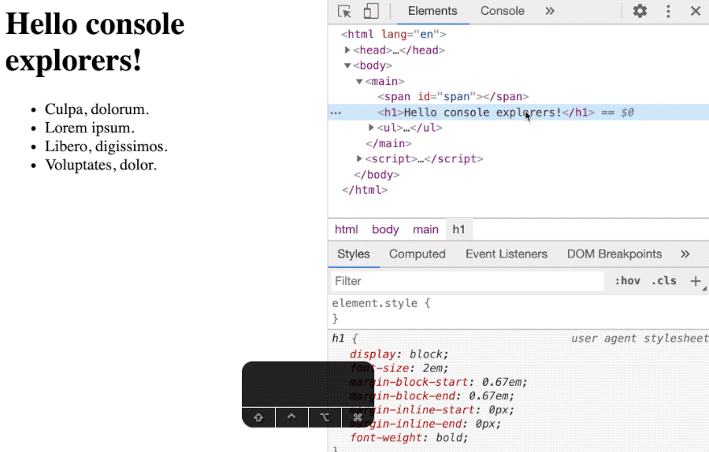
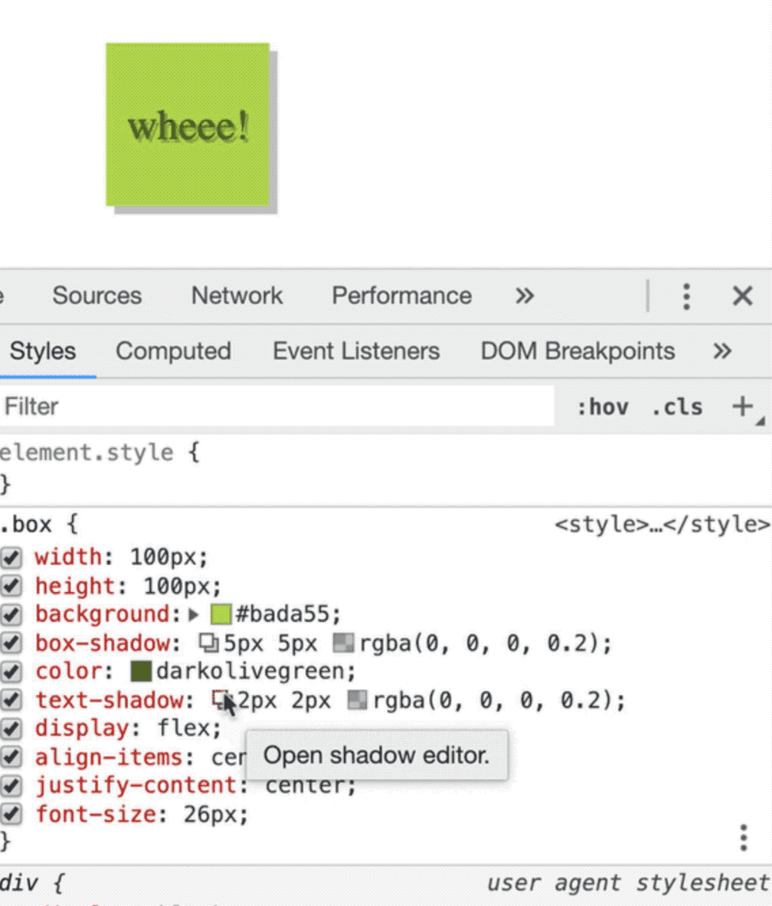
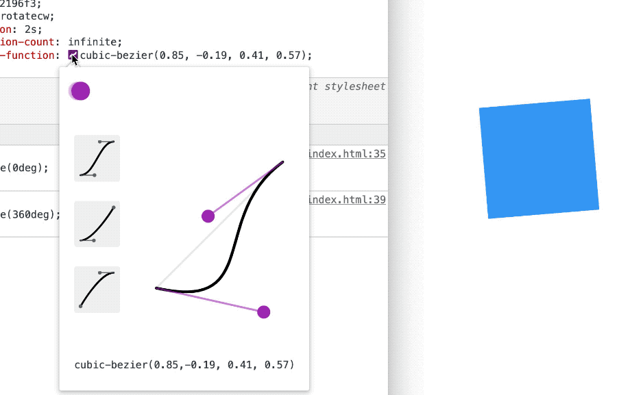

:::tip 问题
仔细深入的话，元素面板里面还有很多被忽略的功能。
:::

### 1. 元素面板中类似于基础编辑器的操作

从某一点来看，我们可以拖动，放置，编辑，复制(当然，以及使用 `[ctrl]` + `[v]` 来粘贴)， 所以我们可以在元素面板里把 `HTML` 结构搞得一团糟。在任意一个编辑器中都有一个标准，那么如何撤回你的操作呢？

使用 `[ctrl]` + `[z]` ( `[⌘]` + `[z]` on Mac)撤销我们的任何改动。
使用 `[ctrl]` + `[shift]` + `[z]` 重新编辑我们的任何修改。

### 2. `Shadow editor` 阴影编辑器

听起来很不吉利(译者注：阴影哪里不吉利了！)，但是它也只是一个小部件而已。你可以通过在 `Style` 面板中点击靠近 `box-shadow` 属性或者 `text-shadow` 属性的 `阴影方形符号` 来打开它：

### 3. `Cubic bezier` 贝塞尔曲线编辑器

贝塞尔曲线，通常用来定义 `CSS` 的动画速度在动画各个阶段中的变化 。一般将其定义为 `transition-timing-function` 或者 `animation-timing-function` CSS 属性。

像之前说的 `Color picker` 和 `Shadow editor` 一样，直接点击边上的曲线符号：

:::warning 请注意
如果使用简写的形式，但是没有定义这个值的话，是看不到这个曲线符号的
:::

网上有很多关于贝塞尔曲线的解释，一打开都是一堆公式和函数，有兴趣钻研是最好，但是最基本的，你只要知道这个线是怎么影响动画的速度就知道怎么用了：

横轴是时间，竖轴是动画的整个进程。也就是说，如果两个点之间的线，越接近垂直：横坐标的差越小意味着 → 时间越短；纵坐标的差越大 → 进程占比越大。

换句话说，我在越短的时间要执行越多的动画，process(大)/time(小) = v (越大)，动画的速度越快！

反过来，线越接近水平：时间越长，进程占比越小，process(小)/time(大) = v(越小)，动画的速度越慢。

解释完毕，一个公式都不需要会。

:::tip 敲黑板
想试试 `3D` 动画：直接在容器元素中设置一个 `perspective` 属性。例如：在 `body` 元素中设置 `perspective: 200px;` 
:::
